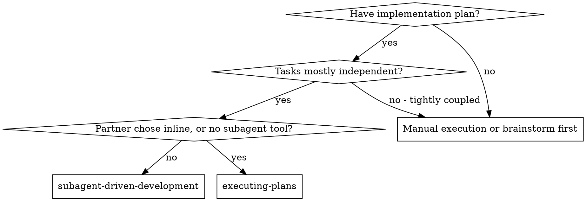
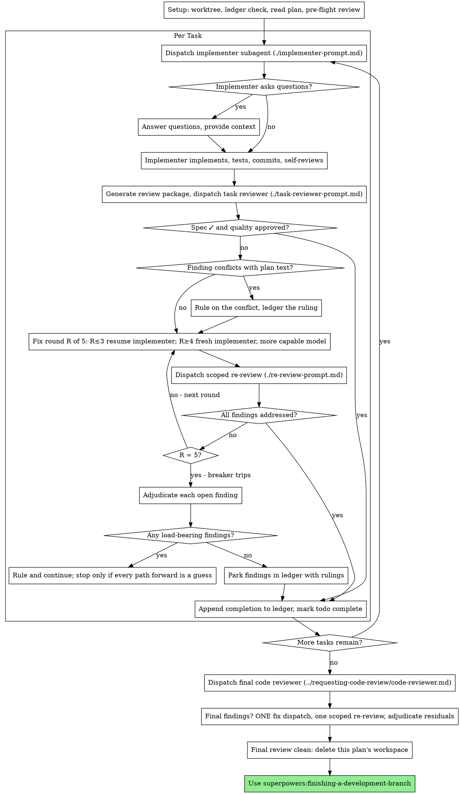

# Subagent-Driven Development

Execute plan by dispatching a fresh implementer subagent per task, a task review (spec compliance + code quality) after each, and a broad whole-branch review at the end.

**Why subagents:** You delegate tasks to specialized agents with isolated context. By precisely crafting their instructions and context, you ensure they stay focused and succeed at their task. They should never inherit your session's context or history — you construct exactly what they need. This also preserves your own context for coordination work.

**Core principle:** Fresh subagent per task + task review (spec + quality) + broad final review = high quality, fast iteration

**Narration:** between tool calls, narrate at most one short line — the
ledger and the tool results carry the record.

**Continuous execution:** Do not pause to check in with your human partner between tasks. Execute all tasks from the plan without stopping. The only reasons to stop are the four named below, or all tasks complete. "Should I continue?" prompts and progress summaries waste their time — they asked you to execute the plan, so execute it.

**Rulings, not stalls.** A running plan does not wait on a human. Conflicts,
ambiguities, plan defects, a cap you would have asked to exceed — decide
them. The spec is the binding authority, the plan is its argument, and your
judgment settles what neither answers. Record every decision in the ledger as
`Ruling: <what you decided> — <why> — <what it costs if wrong>`, and keep
going. A wrong ruling costs rework your human partner can see and undo; a
session parked on a question costs their whole day and buys nothing.

Four things stop you, and only these: an irreversible or destructive
operation; a security-sensitive action; a side effect outside this worktree
that norms say you ask about first (a merge, a push to a shared branch, a
publish); and a plan so broken that every path forward is a guess. For those,
stop and ask.

## When to Use

**vs. Executing Plans (inline):**
- Fresh subagent per task (no context pollution) instead of one context doing every task
- Review after each task (spec compliance + code quality) instead of only at the end
- Costs a fresh context per task and per review; inline costs one context plus one final reviewer
- Both run in this session, share the same plan workspace and ledger, and never pause between tasks

## The Process

## Setup

Ensure the work happens in an isolated workspace: use
superpowers:using-git-worktrees to create one or verify the existing one.
Never start implementation on a main/master branch without your human
partner's explicit consent.

Read the plan once, note its context and Global Constraints, and create a
todo per task. If the plan names a Spec, read that too: the spec is the
authority the plan argues from, and conflicts inside the plan resolve
against it.

## The Task Loop

### 1. Dispatch the implementer
Record BASE (`git rev-parse HEAD`) before dispatching — the review package
and fix-round diffs need it.

- **Task brief:** extract the task's full text and provide exact values verbatim.
- **Report file:** implementer writes the full report there and returns status, commits, test summary, and concerns.

### 2. Handle the report
Implementer subagents report one of four statuses:
- **DONE:** Generate review package and dispatch task reviewer.
- **DONE_WITH_CONCERNS:** Address doubts before review if needed.
- **NEEDS_CONTEXT:** Provide missing context and re-dispatch.
- **BLOCKED:** Assess blocker, provide context or break into smaller pieces.

### 3. Review the task
Per-task reviews are task-scoped gates checking spec compliance and code quality.

### 4. The fix loop
Triggers when the review reports spec gaps or critical/important findings. Up to 5 fix rounds max per task.

### 5. Complete the task
When review comes back clean or all open findings are parked with rulings, mark todo complete and move to next task.

## Final Review
Run final whole-branch review at the end before finishing the development branch.
