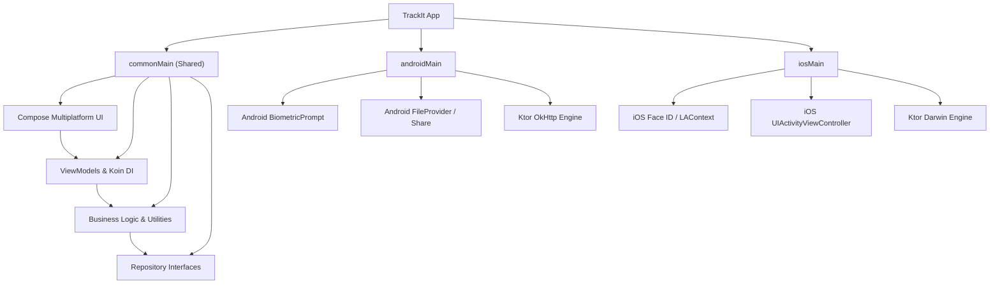

# 🎤 TrackIt — Cross-Platform Smart Voice Expense Tracker (Android & iOS)

> Aplikasi pencatatan keuangan pribadi cerdas dan perencana pernikahan lintas platform (**Android & iOS**) berbasis **Compose Multiplatform (CMP)** dan **Kotlin Multiplatform (KMP)**. Dilengkapi teknologi **Offline Voice Tracking** (Speech-to-Text), **Natural Machine Learning** untuk kategorisasi otomatis, keamanan biometrik (Fingerprint & Face ID), dan pipeline **CI/CD Otomatis** untuk build Android (`.apk`) & iOS sekaligus di GitHub Actions.

---

## 📋 Daftar Isi

- [Tentang Aplikasi](#-tentang-aplikasi)
- [Dukungan Platform](#-dukungan-platform)
- [Fitur Utama](#-fitur-utama)
- [Tech Stack](#-tech-stack)
- [Arsitektur Sistem Multiplatform](#-arsitektur-sistem-multiplatform)
- [Struktur Proyek](#-struktur-proyek)
- [Alur Pengguna](#-alur-pengguna)
- [Cara Menjalankan (Android & iOS)](#-cara-menjalankan-android--ios)
- [CI/CD & Rilis Otomatis](#-cicd--rilis-otomatis)
- [Konfigurasi & Perizinan](#-konfigurasi--perizinan)

---

## 🎯 Tentang Aplikasi

**TrackIt** adalah aplikasi pencatatan keuangan pribadi dan wedding planner yang dirancang untuk menghilangkan hambatan dalam mencatat pemasukan dan pengeluaran. Dengan memanfaatkan teknologi **Voice Tracking** dan pengenalan bahasa alami (*Natural Language Parser*), pengguna cukup mengucapkan transaksi (misal: *"beli sayur 50 ribu"* atau *"dapat gaji 5 juta"*) dan sistem akan mengisi formulir secara otomatis beserta kategorinya!

### Target Pengguna
- 🎯 **Semua Orang** yang ingin mengelola, melacak, dan mengontrol keuangan pribadinya di **Android maupun iPhone (iOS)**.
- 💼 **Individu Super Sibuk** yang membutuhkan kecepatan pencatatan pengeluaran semudah berbicara.
- 💍 **Calon Pengantin** yang membutuhkan manajemen anggaran pernikahan, vendor, rundown acara, dan tamu undangan.
- 🔒 **Pengguna Peduli Privasi** — data tersimpan aman secara lokal dengan proteksi Biometrik (Fingerprint & Face ID).

---

## 📱 Dukungan Platform

| Platform | Target OS | Teknologi UI | Engine Keamanan |
| :--- | :--- | :--- | :--- |
| 🤖 **Android** | Android 8.0+ (API 26 s/d 34+) | Compose Multiplatform / Material 3 | `androidx.biometric.BiometricPrompt` |
| 🍎 **iOS** | iOS 15.0+ (iPhone & Simulator) | SwiftUI Wrapper + Compose Multiplatform | Apple `LocalAuthentication` (`LAContext` Face ID / Touch ID) |

---

## ✨ Fitur Utama

### 🔴 Core Financial Management
* **Pemasukan & Pengeluaran:** Pencatatan cepat dengan filter tanggal, bulan, tahun, dan pencarian instan.
* **Interactive Charting:** Visualisasi pengeluaran via Donut/Pie Chart & Tren Grafis Garis interaktif (*tap-to-inspect* tooltip) berbasis Compose Canvas murni.
* **Multi-Profile:** Pisahkan pembukuan pribadi, keluarga, atau bisnis dengan mudah.
* **Smart Budget Alert:** Pantau batas anggaran kategori dengan peringatan otomatis.

### 💍 Wedding Planner Mode
* **Manajemen Anggaran & Biaya:** Tracking pengeluaran pernikahan per pos anggaran.
* **Vendor & Dokumen:** Pengelolaan status vendor, kontak, kontrak, dan termin pembayaran.
* **Tamu & Buku Tamu:** Pendataan tamu undangan, RSVP, dan kehadiran.
* **Rundown Acara & Panitia:** Susunan acara detail menit-demi-menit beserta PIC panitia.
* **Ekspor Laporan:** Ekspor laporan pernikahan dan keuangan ke format **PDF (A4)** & **CSV (Excel)**.

### 🟢 Security & Cloud Synchronization
* **Biometric Authentication:** Proteksi instan sidik jari (Android) dan Face ID (iOS).
* **Cloud Sync (Firestore REST):** Sinkronisasi cloud multi-perangkat via REST API berkecepatan tinggi yang bebas pemblokiran gRPC.

---

## 🛠 Tech Stack

| Komponen | Teknologi |
|----------|-----------|
| **Bahasa Utama** | Kotlin 1.9.22 (Multiplatform) & Swift (iOS Wrapper) |
| **UI Framework** | Compose Multiplatform 1.6+ & Jetpack Compose (Material 3) |
| **Dependency Injection** | Koin Multiplatform (`io.insert-koin`) |
| **Networking & REST** | Ktor Client (OkHttp Engine untuk Android, Darwin Engine untuk iOS) |
| **Local Persistence** | Room Database & Multiplatform DataStore |
| **Reactive Streams** | Kotlin Coroutines & StateFlow |
| **CI/CD Pipeline** | GitHub Actions (Dual-platform: `ubuntu-latest` & `macos-latest`) |

---

## 🏗 Arsitektur Sistem Multiplatform



---

## 📂 Struktur Proyek

```
Track-app/
├── .github/workflows/
│   └── multiplatform-build.yml     # CI/CD Dual-Platform (Android & iOS)
├── composeApp/                     # Modul Shared Kotlin Multiplatform
│   ├── build.gradle.kts            # Konfigurasi target Android & iOS
│   └── src/
│       ├── commonMain/             # Logika, ViewModel, dan UI Compose Lintas Platform
│       │   └── kotlin/com/trackit/app/
│       │       ├── di/             # Koin Modules (AppModule, NetworkModule)
│       │       ├── ui/             # Screens & Theme (Theme.kt, Color.kt)
│       │       └── util/           # Expect declarations (Biometric, Exporter, Platform)
│       ├── androidMain/            # Implementasi Actual untuk platform Android
│       └── iosMain/                # Implementasi Actual untuk platform iOS & MainViewController
├── iosApp/                         # Aplikasi iOS Xcode (SwiftUI)
│   └── iosApp/
│       ├── iOSApp.swift            # Entry point aplikasi iOS
│       ├── ContentView.swift       # SwiftUI Wrapper untuk ComposeUIViewController
│       └── Info.plist              # Konfigurasi izin Face ID & identitas bundle
├── app/                            # Modul Android Application
├── build.gradle.kts                # Root Gradle configuration
└── settings.gradle.kts             # Pengaturan repositori multiplatform
```

---

## 🚀 Cara Menjalankan (Android & iOS)

### 🤖 Menjalankan di Android
1. Buka folder proyek di **Android Studio**.
2. Tunggu proses **Gradle Sync** selesai.
3. Pilih konfigurasi target `app` atau `composeApp`.
4. Klik tombol **Run ▶️** pada emulator atau perangkat fisik Android (API 26+).

### 🍎 Menjalankan di iOS (macOS / Xcode)
1. Buka berkas `iosApp/iosApp.xcodeproj` atau folder `iosApp` di **Xcode**.
2. Pastikan target perangkat dipilih ke **iOS Simulator** (misal: iPhone 15 Pro).
3. Klik tombol **Run ▶️** di Xcode. Xcode akan otomatis memanggil tugas Gradle KMP untuk menyusun `ComposeApp.framework` dan menjalankannya di Simulator.

---

## ⚙️ CI/CD & Rilis Otomatis

Proyek ini telah dikonfigurasi dengan pipeline **GitHub Actions** dual-platform di [`.github/workflows/multiplatform-build.yml`](.github/workflows/multiplatform-build.yml):

1. **`build-android` (`ubuntu-latest`):**
   * Mengomputasi APK release Android (`./gradlew assembleRelease`).
   * Menghasilkan artefak `app-trackit-android-v*.apk`.
2. **`build-ios` (`macos-latest`):**
   * Mengonfigurasi lingkungan Xcode dan SDK iOS.
   * Memvalidasi kompilasi binari framework iOS.
3. **`create-release`:**
   * Otomatis membuat GitHub Release resmi dan melampirkan file APK saat tag versi (`v*`) di-push ke repository.

---

## 🔐 Konfigurasi & Perizinan

| Perizinan / Kunci | Platform | Kegunaan |
| :--- | :---: | :--- |
| `USE_BIOMETRIC` | Android | Autentikasi sidik jari di Android |
| `NSFaceIDUsageDescription` | iOS | Izin autentikasi Face ID / Touch ID di iPhone |
| `RECORD_AUDIO` | Android | Pengenalan suara mikrofon (Speech-to-Text) |
| `INTERNET` | Keduanya | Sinkronisasi cloud Firestore REST API |

---

*Dibuat dengan ❤️ menggunakan Kotlin Multiplatform, Compose Multiplatform, dan SwiftUI.*
