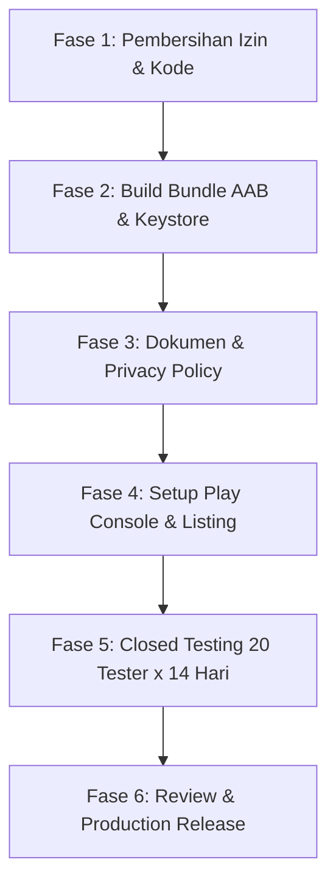

# 📱 Laporan Audit Kesiapan Google Play Store — TrackIt

> **Status Kesiapan:** 🟡 **Belum Siap Rilis Langsung (Memerlukan Perbaikan Kebijakan & Teknis)**  
> **Tanggal Audit:** 14 September 2026  
> **Target Package:** `com.trackit.app`  
> **Target SDK:** 34 (Android 14)  

---

## Executive Summary

Aplikasi **TrackIt** memiliki kualitas kode, arsitektur, dan UI yang sangat baik serta sudah memenuhi spesifikasi teknis dasar Google Play (Target SDK 34, Min SDK 26, ProGuard/R8 aktif). Namun, **aplikasi ini akan langsung DITOLAK (REJECTED) oleh Google Play Review jika di-submit dalam kondisi saat ini** karena terdapat **2 izin berbahaya yang melanggar kebijakan inti Google Play**, mekanisme update internal yang dilarang, serta belum adanya fitur wajib penghapusan akun (*Account Deletion*).

---

## 🚨 1. Temuan Kritis (Critical Blockers — Pasti Ditolak Google Play)

| No | Isu / Pelanggaran Kebijakan | Lokasi | Mengapa Ditolak oleh Google Play? | Solusi Wajib |
|:---|:---|:---|:---|:---|
| 1 | **Izin `MANAGE_EXTERNAL_STORAGE`** | `AndroidManifest.xml:10` | Google Play melarang keras izin ini kecuali aplikasi berjenis File Manager/Antivirus. TrackIt adalah aplikasi keuangan. | **Hapus izin ini**. TrackIt sudah menggunakan *Storage Access Framework* & `FileProvider` untuk ekspor file. |
| 2 | **Izin `REQUEST_INSTALL_PACKAGES` & GitHub Updater** | `AndroidManifest.xml:12`, `AppUpdateDownloader.kt` | Kebijakan *Device and Network Abuse* melarang aplikasi mengunduh dan menginstal APK sendiri di luar Google Play Store. | **Hapus izin ini**. Hapus/nonaktifkan fitur unduh APK mandiri, gunakan *Google Play In-App Updates API* atau serahkan update sepenuhnya ke Play Store. |
| 3 | **Format Rilis Masih APK (Bukan AAB)** | `.github/workflows`, `CI_CD_GUIDE.md` | Sejak Agustus 2021, Google Play mewajibkan format **Android App Bundle (`.aab`)** untuk aplikasi baru, bukan `.apk`. | Tambahkan task `./gradlew bundleRelease` di CI/CD untuk menghasilkan file `.aab`. |
| 4 | **Fitur Wajib Hapus Akun (Account Deletion Requirement)** | `AuthRepository.kt`, `SettingsScreen.kt` | Kebijakan Google Play mewajibkan aplikasi yang memiliki fitur registrasi/login (Firebase Auth) menyediakan opsi **Hapus Akun & Data** di dalam aplikasi dan formulir web. | Tambahkan fungsi `deleteAccount()` pada `AuthRepository` dan tombol hapus akun di menu Pengaturan. |

---

## ⚠️ 2. Temuan Keamanan & Kebijakan Data (High Priority)

### A. Izin Kontak (`READ_CONTACTS`)
* **Kondisi:** Digunakan pada fitur Buku Tamu Pernikahan (`WeddingGuestsScreen.kt`) untuk mengambil kontak.
* **Risiko Kebijakan:** Google Play mengklasifikasikan `READ_CONTACTS` sebagai *Dangerous Permission*. Developer wajib mengisi deklarasi ketat di Play Console.
* **Rekomendasi Terbaik:** Ganti pemanggilan izin manual dengan **`ActivityResultContracts.PickContact()`**. Menggunakan Contact Picker bawaan Android **TIDAK memerlukan izin `READ_CONTACTS` sama sekali**, sehingga 100% bebas dari investigasi Play Store!

### B. Izin Mikrofon (`RECORD_AUDIO`)
* **Kondisi:** Digunakan untuk fitur pencatatan suara (*Offline Speech-to-Text*).
* **Kewajiban Kebijakan:**
  1. Wajib memiliki **Prominent Disclosure** (dialog penjelasan sebelum izin diminta: mengapa aplikasi butuh mikrofon dan data suara tidak dikirim ke pihak ketiga).
  2. Wajib dicantumkan secara transparan di dokumen **Kebijakan Privasi (Privacy Policy)**.

### C. Keystore & Password Hardcoded
* **Kondisi:** File `trackit-keystore.jks` dan password `trackit123` tertulis langsung di `app/build.gradle.kts`.
* **Kewajiban:**
  1. Daftarkan aplikasi ke **Play App Signing** di Google Play Console.
  2. Gunakan Environment Variables atau GitHub Secrets (`RELEASE_KEYSTORE_BASE64`, `KEYSTORE_PASSWORD`, dll) agar sertifikat produksi tidak bocor di repositori publik.

### D. Keunikan Package Name (`applicationId`)
* **Kondisi:** `applicationId = "com.trackit.app"`
* **Perhatian:** Nama package `com.trackit.app` sangat umum dan kemungkinan besar sudah diklaim oleh developer lain di Google Play Store. Jika sudah terpakai saat registrasi di Play Console, kamu wajib mengubahnya (contoh: `com.rivaldi.trackit` atau `id.valtech.trackit`).

---

## 📋 3. Persyaratan Akun & Registrasi Google Play Console

Jika ini adalah akun Google Play Developer personal/perorangan yang dibuat setelah **13 November 2023**, Google memberlakukan aturan baru:

1. **Biaya Pendaftaran:** Sekali bayar sebesar **$25 USD** via kartu kredit/debit visa-mastercard.
2. **Aturan 20 Tester Selama 14 Hari (Closed Testing):**
   * Sebelum bisa rilis ke Production (publik), aplikasi **wajib** diuji coba dalam track *Closed Testing*.
   * Minimal **20 orang tester** harus *opt-in* dan menginstal aplikasi selama **14 hari berturut-turut**.
   * Setelah 14 hari, kamu baru bisa mengajukan permohonan akses ke *Production Track*.

---

## 🎨 4. Checklist Aset Toko (Store Listing Assets)

Sebelum menekan tombol submit di Play Console, siapkan aset-aset berikut:

| Aset | Spesifikasi Teknis | Keterangan |
|:---|:---|:---|
| **App Icon** | 512 x 512 px, 32-bit PNG, maks 1 MB | Tanpa transparansi latar belakang (harus solid). |
| **Feature Graphic** | 1024 x 500 px, JPG atau 24-bit PNG, maks 1 MB | Banner utama yang muncul di bagian atas Play Store listing. |
| **Phone Screenshots** | Minimal 4 screenshot, rasio 16:9 atau 9:16, min 1080px | Menampilkan Dashboard, Voice Input, Statistik Grafik, dan Wedding Planner. |
| **Tablet Screenshots** | Minimal 1 screenshot untuk tablet 7 inci & 10 inci | Wajib jika mengaktifkan target tablet. |
| **Short Description** | Maksimal 80 karakter | Deskripsi singkat pemikat pengguna. |
| **Full Description** | Maksimal 4000 karakter | Deskripsi lengkap fitur dan keunggulan. |
| **Privacy Policy URL** | URL Web Publik yang dapat diakses | Berisi rincian data: Audio, Biometric, Email/Auth, Firestore. |

---

## 🛠 5. Action Plan Bertahap Menuju Play Store

### Langkah Konkret yang Harus Dikerjakan:
1. **Pembersihan `AndroidManifest.xml`:**
   * Hapus `MANAGE_EXTERNAL_STORAGE`.
   * Hapus `REQUEST_INSTALL_PACKAGES`.
   * Ganti `READ_CONTACTS` dengan `PickContact()` picker bawaan.
2. **Nonaktifkan / Pisahkan GitHub APK Updater:**
   * Hapus pemanggilan `installApk` otomatis atau buat build flavor khusus Play Store (tanpa updater).
3. **Tambahkan Fitur Hapus Akun:**
   * Tambahkan API penghapusan akun Firebase Auth + hapus data Firestore pengguna.
4. **Konfigurasi Build Bundle (`.aab`):**
   * Tambahkan task `./gradlew bundleRelease` di pipeline CI/CD GitHub Actions.
5. **Buat Halaman Kebijakan Privasi (Privacy Policy):**
   * Hosting halaman privasi (misal di GitHub Pages atau Notion publik) yang menjelaskan penggunaan mikrofon dan penyimpanan lokal/cloud.
6. **Uji Coba Closed Testing:**
   * Upload file `.aab` ke track Closed Testing di Google Play Console dan undang 20 teman/kolega untuk menguji selama 14 hari.
