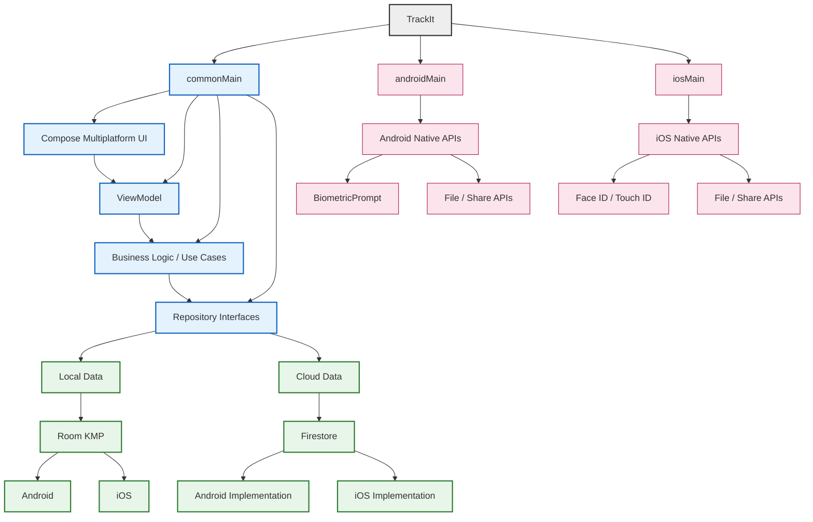

# Implementation Plan: Compose Multiplatform (CMP) & iOS Support for TrackIt

Migrate the current Android-only TrackIt application (Kotlin + Jetpack Compose) to **Compose Multiplatform (CMP) / Kotlin Multiplatform (KMP)** to target both **Android** and **iOS** from a single codebase, and configure **GitHub Actions** to build both Android (`.apk`/`.aab`) and iOS (`.ipa`) packages simultaneously on `git push`.

---

## User Review Required

> [!IMPORTANT]
> **Key Architectural Changes & Library Substitutions Required:**
> 1. **Dependency Injection**: **Dagger Hilt** is Android-only. We will migrate DI to **Koin** (supported natively on Android and iOS).
> 2. **Firebase SDK**: Firebase Firestore will be migrated from the Android-only Firebase SDK to a KMP-compatible Firestore solution. The implementation will first evaluate the currently supported KMP Firestore options. If a suitable shared SDK is unavailable or introduces compatibility risks, Firestore access will be isolated behind a common repository interface with platform-specific Android/iOS implementations.
> 3. **Database**: Migrate the existing Room database to Room KMP. SQLDelight will only be considered if Room KMP proves incompatible with the existing database schema or required functionality.
> 4. **Network Client**: OkHttp will be replaced with **Ktor Client** (`ktor-client-okhttp` on Android, `ktor-client-darwin` on iOS).
> 5. **Native Features (Biometrics, PDF Export, File Picker)**: Android `BiometricPrompt` and `ActivityResultContracts` will be refactored into `expect` / `actual` declarations for platform-specific implementations (`LAContext` on iOS).
> 6. **Chart Library**: **Vico Chart** is Android-only. We will replace or adapt chart rendering to native Compose Canvas / KMP-compatible chart drawing.
> 7. **GitHub Runner Requirement**: iOS builds require `macos-latest` runner on GitHub Actions. (GitHub provides 2,000 free runner minutes/month for public repos, but macOS consumes 10x multiplier = 200 mins).

> [!WARNING]
> **iOS Signing & Apple Developer Account:**
> - To produce a signed `.ipa` file installable on physical iPhones or App Store, an Apple Developer Account (\$99/year) and provisioning profiles are required.
> - Without a paid account, GitHub Actions can build an unsigned `.ipa` / Xcode framework archive for simulator & testing.

---

## Open Questions

> [!NOTE]
> 1. **Apple Developer Account**: Do you currently have an Apple Developer Account for iOS code signing in GitHub Actions, or should we set up the CI pipeline for unsigned simulator/testing builds first?
> 2. **iOS Minimum Version**: Should we target iOS 15.0+ as the minimum supported iOS version?
> 3. **Charts Preference**: TrackIt features custom pie charts and line charts (`ChartScreen.kt`). Should we build fully custom Compose Multiplatform Canvas charts (which gives 100% UI consistency across platforms) or use a KMP chart library?

---

## Proposed Changes

```
TrackIt/
├── composeApp/                     # Shared KMP module
│   ├── src/
│   │   ├── commonMain/             # Shared UI (Compose) & Logic (ViewModels, Repositories)
│   │   ├── androidMain/            # Android-specific implementations (Android Biometric, Context)
│   │   └── iosMain/                # iOS-specific implementations (LAContext, iOS File Exporter)
├── iosApp/                         # Xcode project wrapper for iOS
├── build.gradle.kts                # Root Gradle configuration with Compose Multiplatform plugin
└── .github/workflows/
    └── multiplatform-build.yml     # Dual-platform GitHub Actions workflow
```

---

### Phase X: Navigation & Lifecycle Migration

- Migrate shared navigation to KMP-compatible Navigation.
- Move ViewModels to commonMain where possible.
- Remove direct Android Context/Activity dependencies from shared ViewModels.
- Keep platform-specific functionality behind interfaces.

### Phase 0: Dependency & Android API Audit

Audit seluruh dependency dan API Android-specific yang digunakan
TrackIt sebelum melakukan migrasi.

Fokus:
- Firebase Firestore
- Hilt
- Room
- DataStore
- OkHttp
- Vico
- Navigation
- BiometricPrompt
- ActivityResultContracts
- Android Context / Activity / Intent
- PDF / CSV export

### Phase 1: Build System & Gradle Configuration

#### [MODIFY] [build.gradle.kts](file:///c:/Rivaldi/Track-app/build.gradle.kts)
- Use the latest stable Compose Multiplatform version compatible with the selected Kotlin, Gradle, Android Gradle Plugin, and Xcode versions.

#### [MODIFY] [settings.gradle.kts](file:///c:/Rivaldi/Track-app/settings.gradle.kts)
- Include `:composeApp` and configure JetBrains Compose plugin repositories.

#### [NEW] [composeApp/build.gradle.kts](file:///c:/Rivaldi/Track-app/composeApp/build.gradle.kts)
- Define targets: `androidTarget()`, `iosX64()`, `iosArm64()`, `iosSimulatorArm64()`.
- Add dependencies for KMP: Koin, Ktor, Room KMP, DataStore KMP, Compose Multiplatform, Firebase KMP.

---

### Phase 2: Dependency Injection & Logic Migration (Hilt -> Koin)

#### [NEW] [composeApp/src/commonMain/kotlin/com/trackit/app/di/AppModule.kt](file:///c:/Rivaldi/Track-app/composeApp/src/commonMain/kotlin/com/trackit/app/di/AppModule.kt)
- Define Koin modules for ViewModels, Repositories, UseCases, and Database instances.

#### [DELETE] Hilt annotations across ViewModels and Repositories
- Remove `@HiltViewModel`, `@Inject`, `@AndroidEntryPoint` across all codebase files.
- Replace `@Inject constructor(...)` with standard Kotlin constructors.

---

### Phase 3: Platform Abstractions (`expect` / `actual`)

#### [NEW] [composeApp/src/commonMain/kotlin/com/trackit/app/util/BiometricAuth.kt](file:///c:/Rivaldi/Track-app/composeApp/src/commonMain/kotlin/com/trackit/app/util/BiometricAuth.kt)
- Declare `expect class BiometricAuthenticator` interface for authenticating users.

#### [NEW] [composeApp/src/androidMain/kotlin/com/trackit/app/util/BiometricAuth.android.kt](file:///c:/Rivaldi/Track-app/composeApp/src/androidMain/kotlin/com/trackit/app/util/BiometricAuth.android.kt)
- Implement `actual class BiometricAuthenticator` using `androidx.biometric.BiometricPrompt`.

#### [NEW] [composeApp/src/iosMain/kotlin/com/trackit/app/util/BiometricAuth.ios.kt](file:///c:/Rivaldi/Track-app/composeApp/src/iosMain/kotlin/com/trackit/app/util/BiometricAuth.ios.kt)
- Implement `actual class BiometricAuthenticator` using iOS `LocalAuthentication` (`LAContext`).

#### [NEW] [composeApp/src/commonMain/kotlin/com/trackit/app/util/FileExporter.kt](file:///c:/Rivaldi/Track-app/composeApp/src/commonMain/kotlin/com/trackit/app/util/FileExporter.kt)
- Declare `expect class FileExporter` for PDF & CSV export capabilities.

---

### Phase 4: UI Layer Migration to `commonMain`

#### [MODIFY] Move all Screens to `commonMain`
- Move `DashboardScreen.kt`, `TransactionListScreen.kt`, `ChartScreen.kt`, `ProfileScreen.kt`, `WeddingPlannerScreen.kt`, `CategoryManagementScreen.kt` to `composeApp/src/commonMain/kotlin/com/trackit/app/ui/`.
- Convert custom drawing in `ChartScreen.kt` to pure Compose Canvas for cross-platform compatibility.

---

### Phase 5: iOS Project Setup (`iosApp`)

#### [NEW] [iosApp/iosApp.xcodeproj](file:///c:/Rivaldi/Track-app/iosApp/iosApp.xcodeproj)
- Create iOS Xcode application entry point.

#### [NEW] [iosApp/iosApp/iOSApp.swift](file:///c:/Rivaldi/Track-app/iosApp/iosApp/iOSApp.swift)
- SwiftUI App entry point calling `MainViewController` from `composeApp`.

#### [NEW] [composeApp/src/iosMain/kotlin/com/trackit/app/MainViewController.kt](file:///c:/Rivaldi/Track-app/composeApp/src/iosMain/kotlin/com/trackit/app/MainViewController.kt)
- Export `ComposeUIViewController` wrapping `TrackItApp()` UI.

---

### Phase 6: CI/CD Pipeline Update for Dual Platform

#### [MODIFY] [.github/workflows/android-build.yml](file:///c:/Rivaldi/Track-app/.github/workflows/android-build.yml) -> rename to `multiplatform-build.yml`
- Restructure into 2 parallel jobs:
  1. `build-android` (runs on `ubuntu-latest`):
     - Sets up JDK 17
     - Runs `./gradlew :composeApp:assembleRelease`
     - Uploads `.apk` / `.aab` artifact.
  2. `build-ios` (runs on `macos-latest`):
     - Sets up JDK 17 & Xcode
     - Configures CocoaPods / Kotlin framework build
     - Runs `./gradlew :composeApp:embedAndSignAppleFrameworkForXcode` / `xcodebuild`
     - Uploads `.ipa` or Xcode archive artifact.
  3. `release` (runs after build jobs succeed):
     - Publishes GitHub Release attaching both Android APK and iOS artifact.

---

## Verification Plan

### Automated Tests
- `./gradlew :composeApp:desktopTest` / `./gradlew :composeApp:testDebugUnitTest` - Run unit tests for repositories and ViewModels across commonMain.
- `./gradlew :composeApp:iosX64Test` - Run iOS target unit tests on macOS runner.

### Manual Verification
1. **Android App Execution**: Build & run `./gradlew :composeApp:installDebug` on Android device/emulator. Verify Dashboard, Transactions, Charts, Sync, and Biometric lock work.
2. **iOS App Execution**: Build & run Xcode `iosApp` on iOS Simulator (iPhone 15 Pro). Verify Compose UI renders natively, navigation works smoothly, and local storage works.
3. **CI/CD Pipeline Validation**: Push tag `v3.6.0` to GitHub. Verify GitHub Actions runs `build-android` on `ubuntu-latest` and `build-ios` on `macos-latest`, producing both `.apk` and `.ipa` attached to the release.

