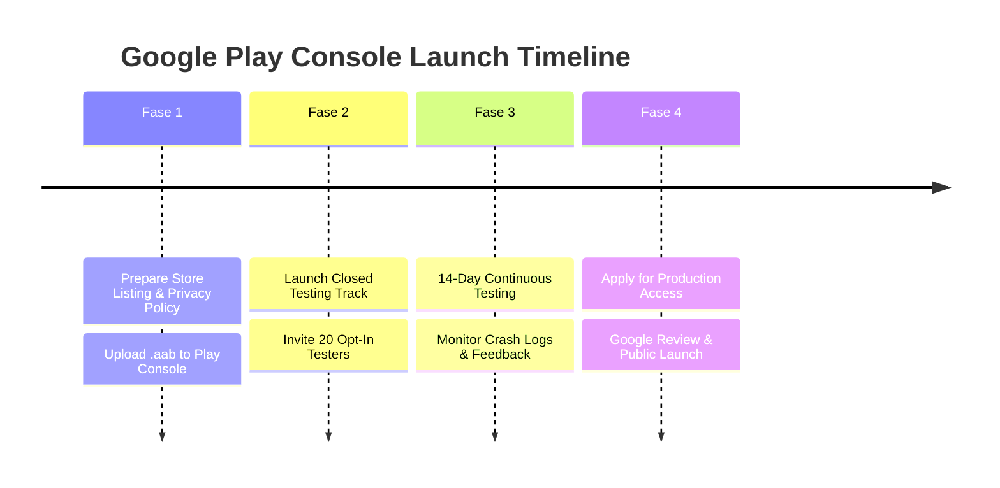

# Implementation Plan: Google Play Store Publication & Compliance Roadmap for TrackIt

Prepare, remediate, and publish the **TrackIt** application to the **Google Play Store**. This plan details all technical changes, permission cleanups, security hardening, App Bundle (`.aab`) build pipelines, Google Play Policy compliance tasks, and closed testing procedures required for a successful store launch.

---

## User Review Required

> [!IMPORTANT]
> **Key Policy Compliance & Code Changes Required:**
> 1. **Permission Remediation**: Remove `MANAGE_EXTERNAL_STORAGE` and `REQUEST_INSTALL_PACKAGES` from `AndroidManifest.xml` to prevent immediate rejection.
> 2. **Contact Picker Refactoring**: Replace `READ_CONTACTS` permission usage in `WeddingGuestsScreen.kt` with `ActivityResultContracts.PickContact()`, which requires zero permissions.
> 3. **Account Deletion (Mandatory Play Store Policy)**: Add an in-app "Hapus Akun / Delete Account" feature in `SettingsScreen.kt` and `AuthRepository.kt` that deletes the user's Firebase Auth account and purges their cloud data.
> 4. **In-App Update Strategy**: Separate GitHub APK auto-updater logic from the Play Store build (or integrate Google Play In-App Update API).
> 5. **Android App Bundle (.aab)**: Update Gradle build scripts and GitHub Actions CI/CD to generate `.aab` format required by Google Play.

> [!WARNING]
> **Personal Developer Account Testing Requirement (New Google Policy):**
> - For personal developer accounts created after Nov 13, 2023, Google Play requires passing **Closed Testing with at least 20 opted-in testers for 14 continuous days** before Production release access is granted.

---

## Proposed System Architecture

```
TrackIt Publishing Pipeline/
├── app/
│   ├── build.gradle.kts                # Configured for .aab bundleRelease & Play App Signing
│   ├── src/main/
│   │   ├── AndroidManifest.xml         # Cleaned permissions (Removed MANAGE_EXTERNAL_STORAGE & REQUEST_INSTALL_PACKAGES)
│   │   └── java/com/trackit/app/
│   │       ├── data/repository/
│   │       │   └── AuthRepository.kt   # Added deleteAccount() API
│   │       ├── ui/settings/
│   │       │   └── SettingsScreen.kt   # Added Account Deletion UI dialog
│   │       └── updater/
│   │           └── AppUpdateChecker.kt # Scoped updater for Play Store vs GitHub flavors
└── .github/workflows/
    └── multiplatform-build.yml         # Generates both .apk (GitHub) and .aab (Play Store)
```

---

## Detailed Execution Phases

### Phase 1: Manifest & Permission Cleanups (Critical Policy Compliance)

Audit and remove all non-compliant permissions in `app/src/main/AndroidManifest.xml`.

#### [MODIFY] [AndroidManifest.xml](file:///c:/Rivaldi/Track-app/app/src/main/AndroidManifest.xml)
- **Remove**: `<uses-permission android:name="android.permission.MANAGE_EXTERNAL_STORAGE" />`
  - *Reason*: Violates Google Play Scoped Storage policy for non-file-manager apps.
- **Remove**: `<uses-permission android:name="android.permission.REQUEST_INSTALL_PACKAGES" />`
  - *Reason*: Violates Google Play Device & Network Abuse policy for self-updating APKs.
- **Refactor Contact Access**: Remove `<uses-permission android:name="android.permission.READ_CONTACTS" />`.

#### [MODIFY] [WeddingGuestsScreen.kt](file:///c:/Rivaldi/Track-app/app/src/main/java/com/trackit/app/ui/wedding/guests/WeddingGuestsScreen.kt)
- Replace permission launcher `contactPermissionLauncher.launch(Manifest.permission.READ_CONTACTS)` with native system picker `ActivityResultContracts.PickContact()`.
- Extract contact name and phone number from Uri without requesting dangerous `READ_CONTACTS` permission.

#### [MODIFY] [ContactUtils.kt](file:///c:/Rivaldi/Track-app/app/src/main/java/com/trackit/app/util/ContactUtils.kt)
- Update helper methods to read contact details directly from Uri returned by `PickContact()`.

---

### Phase 2: Mandatory Account Deletion Feature (Policy Compliance)

Google Play mandates that any app offering account creation must allow users to delete their account and associated data directly from within the app and via a web request.

#### [MODIFY] [AuthRepository.kt](file:///c:/Rivaldi/Track-app/app/src/main/java/com/trackit/app/data/repository/AuthRepository.kt)
- Add `suspend fun deleteAccount(): AuthResult` method:
  1. Re-authenticate user if required by Firebase Auth.
  2. Call `SyncManager.clearLocalData()` to wipe Room database tables.
  3. Delete user documents from Firestore via `FirestoreRestClient.delete("users/$userId")`.
  4. Call `auth.currentUser?.delete()`.

#### [MODIFY] [SettingsScreen.kt](file:///c:/Rivaldi/Track-app/app/src/main/java/com/trackit/app/ui/settings/SettingsScreen.kt)
- Add "Hapus Akun & Data Saya" option under Security/Account section.
- Display red confirmation dialog warning: *"Semua data transaksi dan akun Anda akan dihapus secara permanen dari perangkat dan cloud."*
- Trigger `deleteAccount()` and navigate to Login screen upon success.

---

### Phase 3: In-App Updater Refactoring (GitHub vs Play Store Build Flavors)

Prevent Google Play rejection due to direct APK downloading while preserving GitHub Releases auto-updater for sideloaded builds.

#### [MODIFY] [app/build.gradle.kts](file:///c:/Rivaldi/Track-app/app/build.gradle.kts)
- Introduce Gradle Build Flavors:
  ```kotlin
  flavorDimensions += "distribution"
  productFlavors {
      create("github") {
          dimension = "distribution"
          buildConfigField("Boolean", "ENABLE_GITHUB_UPDATER", "true")
      }
      create("playstore") {
          dimension = "distribution"
          buildConfigField("Boolean", "ENABLE_GITHUB_UPDATER", "false")
      }
  }
  ```

#### [MODIFY] [AppUpdateChecker.kt](file:///c:/Rivaldi/Track-app/app/src/main/java/com/trackit/app/updater/AppUpdateChecker.kt)
- Check `BuildConfig.ENABLE_GITHUB_UPDATER` before executing update checks. Disable silent update prompts in `playstore` flavor.

---

### Phase 4: App Bundle (.aab) Build & Keystore Hardening

Configure Gradle and CI/CD to produce production-ready `.aab` bundles signed with Play App Signing.

#### [MODIFY] [app/build.gradle.kts](file:///c:/Rivaldi/Track-app/app/build.gradle.kts)
- Replace hardcoded keystore passwords with Environment Variables / Gradle properties:
  ```kotlin
  signingConfigs {
      create("release") {
          storeFile = file(System.getenv("KEYSTORE_PATH") ?: "trackit-keystore.jks")
          storePassword = System.getenv("KEYSTORE_PASSWORD") ?: "trackit123"
          keyAlias = System.getenv("KEY_ALIAS") ?: "trackit"
          keyPassword = System.getenv("KEY_PASSWORD") ?: "trackit123"
      }
  }
  ```

#### [MODIFY] [.github/workflows/multiplatform-build.yml](file:///c:/Rivaldi/Track-app/.github/workflows/multiplatform-build.yml)
- Add build step for App Bundle:
  ```yaml
  - name: Build Release App Bundle (.aab)
    run: ./gradlew bundlePlaystoreRelease
  ```
- Upload both `.apk` (for GitHub Releases) and `.aab` (for Google Play Console upload) as build artifacts.

---

### Phase 5: Privacy Policy, Disclosures & Store Listing Assets

Prepare mandatory legal documents and Play Console graphic assets.

#### [NEW] [docs/PRIVACY_POLICY.md](file:///c:/Rivaldi/Track-app/docs/PRIVACY_POLICY.md)
- Create comprehensive Privacy Policy covering:
  - Voice data handling (processed 100% offline via local SpeechRecognizer, no audio recordings sent to servers).
  - Financial data (stored locally in Room SQLite, synced to private Firebase Firestore).
  - Biometric data (handled entirely by OS via BiometricPrompt/FaceID, zero biometric data collected).
  - User rights (account deletion process and contact email).

#### Store Listing Graphic Assets Checklist:
- [ ] **App Icon**: 512 x 512 px PNG (32-bit, solid background, max 1MB).
- [ ] **Feature Graphic**: 1024 x 500 px JPG/PNG (Hero banner for Play Store listing).
- [ ] **Phone Screenshots**: Minimum 4 high-res screenshots (Dashboard, Voice Tracking, Interactive Charts, Wedding Planner).
- [ ] **Tablet Screenshots**: 7-inch & 10-inch screenshots.
- [ ] **Short Description**: Max 80 characters.
- [ ] **Full Description**: Max 4,000 characters.

---

### Phase 6: Closed Testing Roadmap (20 Testers x 14 Days) & Production Launch

Execution roadmap for Google Play Console submission and compliance testing.



1. **Step 1**: Register Google Play Developer Account ($25 one-time fee) & create App Entry (`com.trackit.app` or updated unique ID).
2. **Step 2**: Upload `app-playstore-release.aab` to **Closed Testing Track**.
3. **Step 3**: Fill out Play Console questionnaires:
   - **Data Safety Questionnaire**: Declare Audio, Personal Info, Financial Data, Authentication.
   - **App Content Declarations**: Financial Features, Sensitive Permissions.
4. **Step 4**: Recur 20 testers for 14 continuous days.
5. **Step 5**: Request Production Access & publish to Google Play Store!

---

## Verification Plan

### Automated Verification
- `./gradlew bundlePlaystoreRelease` — Verify `.aab` builds cleanly without ProGuard/R8 errors.
- `./gradlew testDebugUnitTest` — Verify unit tests pass.

### Manual Policy Verification
1. **Permission Inspection**: Run `aapt2 dump permissions app/build/outputs/bundle/playstoreRelease/app-playstore-release.aab` and confirm `MANAGE_EXTERNAL_STORAGE` and `REQUEST_INSTALL_PACKAGES` are completely absent.
2. **Contact Picker**: Test importing wedding guest contacts via `PickContact()` on Android 14 device without granting `READ_CONTACTS` permission.
3. **Account Deletion Test**: Perform "Hapus Akun" in Settings and verify Firebase Auth user is deleted and Firestore data is cleared.